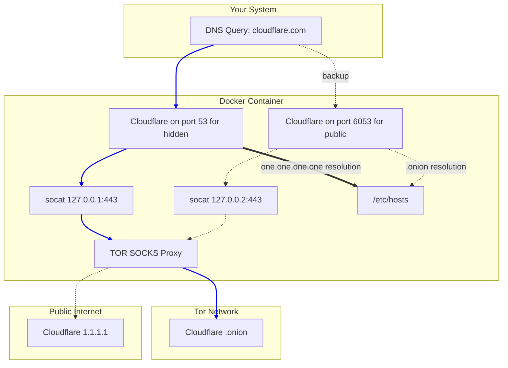

# Understanding

There is significantly reduced value in simply "plugging in" a ready-made code snippet or config file if you don’t first understand the core concepts behind it. This lack of understanding is especially dangerous when adopting privacy- or security-focused technologies. Without grasping what’s happening under the hood, you may unintentionally reduce your security rather than enhance it.

This article will walk you through the **why** and **how** of our DNS-over-Tor setup. You can skip to the section that matches your experience level, or read everything for a complete refresher.

---

## Beginners – DNS Explained

**Topics Covered**
- DNS: Domain Name System
- ISP: Internet Service Provider

DNS is like the internet’s phone book. The web operates on IP addresses, but humans use domain names (like `google.com`). When you enter a website address into your browser, your device silently asks a DNS server: “What IP should I contact for this domain?”

Here's what happens when a typical user sets up internet at home:

1. You plug in your new router.
2. The router communicates with your ISP and receives basic configuration data — including the IP addresses of your ISP’s DNS servers.
3. When your devices connect to the router (via Wi-Fi or Ethernet), the router tells them: “Use me as your DNS resolver.”
4. When your device asks the router “What is the IP for google.com?”, the router forwards that query to your ISP’s DNS server.

DNS servers then respond with something like:
`google.com → 74.125.199.139`

Your browser gets that IP and loads the site. This happens invisibly and very quickly. The user never sees the real IP address and never needs to think about it.

DNS is fundamental to how the web works — no one wants to memorize IP addresses, and they often change.

---

## Intermediate – DNS Privacy Risks

**Topics Covered**
- DNS query privacy and surveillance
- Encrypted DNS protocols

DNS was created long before modern privacy concerns. By default, DNS queries are unencrypted. When you request `MyFavoriteWebsite.com`, your ISP sees this request in plain text — and might log or sell that data.

Even if you manually use a third-party DNS server (like Cloudflare’s `1.1.1.1`), your ISP still sees that you're making a DNS request, even if not what it is. So you're just shifting who can see your traffic.

There are several ways to encrypt DNS queries:

- **DoT** – DNS over TLS
- **DoH** – DNS over HTTPS (looks like regular web traffic)
- **DoHoT** – DNS over HTTPS over Tor (our solution)
- **DoToT** – DNS over TLS over Tor
- **DNSCrypt** – Encrypts and anonymizes DNS queries via relays

However, even with encryption, the DNS resolver (e.g., Cloudflare, Google) still knows what domain you requested. You’ve improved privacy from your ISP, but transferred trust to a new party.

**DNSCrypt** tries to solve this by using relays, but that introduces its own problems:
- You have to trust the relay.
- A malicious relay could collude with the resolver or monitor traffic.

So the question becomes: how do we **avoid trusting any single party**?

---

## Advanced – Our Solution: DNS over HTTPS over Tor (DoHoT)

DoHoT offers strong privacy without needing to trust the ISP, resolver, or relay.

### Why Not Just Use DNS over Tor?

Some try to send raw DNS queries over Tor, exiting the Tor network to a public DNS resolver like Google’s `8.8.8.8`. This is flawed:
- Tor exit nodes can **see and modify** unencrypted DNS traffic.
- This leaks metadata and risks manipulation.

### DNS over HTTPS over Tor

This is better:
- Your DNS queries are encrypted (via HTTPS).
- They look like normal web traffic.
- They travel through the Tor network.
- **Tor exit nodes cannot read or tamper with them.**
- The DNS resolver sees the query, but **does not know where it came from**.

### Two Deployment Options

1. **Primary (via .onion DoH resolver)**
   - We use Cloudflare’s **.onion** DoH endpoint.
   - The entire DNS query stays **inside the Tor network**.
   - Prevents even advanced threats like traffic correlation.
   - To reduce latency, Cloudflare's hidden service uses a **1-hop circuit** (they don't need anonymity, just encryption and routing).

2. **Secondary (standard DoH over Tor)**
   - Still encrypted and private.
   - Leaves the Tor network at an exit node, then contacts Cloudflare’s public DoH endpoint (`1.1.1.1`).
   - Slightly faster, but **less secure** than the full .onion path.

Both are extremely private — and arguably unnecessary unless you’re aiming for maximum DNS privacy.

---

## Concerns

### Latency
Latency is a concern, but local DNS caching makes it mostly unnoticeable. We've run this configuration for over a year with no problems in streaming, gaming, or browsing. Occasionally, a page may take a few seconds longer to load.

### Tor Traffic
Using Tor can attract attention depending on your region. Even though the traffic is light, some observers may flag Tor usage. Be aware of your local threat model.

### Maintenance
This setup is mostly "set it and forget it." We’ve experienced zero maintenance over a year of operation. Your results may vary.

---

## Technical Details

Now for the fun part: **learning how it all works**. Let's walk through each piece of the Docker Compose configuration.

---

### Docker Compose Breakdown


```

version: '3.8'
services:

  tor-dns-proxy:
    build: .
    restart: unless-stopped
    healthcheck:
      test: ["CMD-SHELL", 'dig @127.0.0.1 -p 53 cloudflare.com A +short > /dev/null && dig @127.0.0.1 -p 6053 cloudflare.com A +short > /dev/null']
      interval: 15s
      timeout: 5s
      retries: 10
    expose:                    #this provides access from within docker only, see the ports section for more information
      - "53/udp"
      - "6053/udp"             #backup public resolver, routed through tor
      #- "9100"                 #optional, if you want metrics for the .onion proxy
      #- "9200"                 #optional, if you want metrics for the clearnet proxy
    #ports:                    #uncomment these options to enable access from your local machine, and comment out the two matching entries under "expose"
    #  - "53:53/udp"
    #  - "6053:6053/udp"
    networks:
      - dns_net
    cap_add:
      - NET_ADMIN

networks:
  dns_net

```

1. **Version**
   - Defines the version of the Docker Compose specification you're using.
   - Determines which features and syntax are available.

2. **Services**
   - We define a single service (container) in this example.
   - You can expand to more services as needed.

3. **Container Name**
   - We've named the container `tor-dns-proxy`, but you can change it to anything.
   - This name becomes available via Docker’s internal DNS. For example:
     ```bash
     ping tor-dns-proxy
     ```
     from another container will resolve it, no IP required.

4. **Build Context**
   - The `build: .` line tells Docker to use the current directory (`.`) as the context where the `Dockerfile` lives.
   - You could also specify a subdirectory, e.g., `./proxy`.

5. **Restart Policy**
   - `unless-stopped` ensures the container restarts automatically on crash or reboot.
   - If you stop it manually, it stays stopped.

6. **Healthcheck**
   - Helps Docker determine if the container is "healthy."
   - Useful for orchestrating dependent containers or debugging.
   - **Breakdown**:
     - `test`: The command Docker will run. Here, we use `dig` to test DNS on two ports.
     - `interval`: Run the test every 15 seconds.
     - `timeout`: Give the test 5 seconds to succeed.
     - `retries`: Declare the container unhealthy after 10 failed attempts.

7. **Expose (Internal Ports)**
   - Makes these ports available **inside the Docker network**.
   - Other containers can use this DNS proxy without needing host access.
   - Ports:
     - `53/udp`: Primary DNS
     - `6053/udp`: Secondary (fallback) DNS over Tor
   - These will fail for TCP; it's intentionally UDP-only.

8. **Ports (Host Access)**
   - Uncomment these to expose DNS to your **host system**:
     ```yaml
     ports:
       - "53:53/udp"
       - "6053:6053/udp"
     ```
   - This lets your local computer send DNS queries to `localhost:53`.

   > **Note**: If you're using this proxy only within Docker (e.g., for AdGuard Home, Unbound, etc.), you can skip this and rely on `expose`.

9. **Networks**
   - Assigns this service to a custom Docker network named `dns_net`.
   - This allows container-to-container communication within an isolated namespace.

10. **cap_add**
    - Adds the `NET_ADMIN` capability to the container.
    - Needed for advanced networking tasks (e.g., routing rules, interface tweaks).
    - This can be a security consideration; don't add it unless necessary.

11. **Networks Definition**
    - This is where we actually **create** the `dns_net` network.
    - If you reference a network without defining it, Docker will fail to start.

---

###  Healthcheck Explained

```bash
dig @127.0.0.1 -p 53 cloudflare.com A +short > /dev/null && dig @127.0.0.1 -p 6053 cloudflare.com A +short > /dev/null
```
dig: Command-line DNS query tool.
@127.0.0.1: Query localhost.
-p 53: Use port 53 (standard DNS).
cloudflare.com A +short: Ask for Cloudflare's IPv4 address and shorten the output.
 `>` /dev/null: Throw away the output; we only care if the command succeeds.
&&: Only run the second test if the first succeeds.


##  Dockerfile Explained

In this section, we'll walk through how the container is built from the ground up using a custom `Dockerfile`.

---

###  Step-by-Step Breakdown

1. **Base Image**
   - We're using `alpine:latest` as our starting point because it's lightweight, fast, and highly customizable.
   - While we could have used `image: alpine:latest` directly in the Compose file, that would give us a very minimal container with none of the tools we need.
   - Instead, we use it as a base image to **build** a more functional container using the `build: .` directive.

2. **Install Dependencies**
   - We append additional Alpine package repositories, including:
     - `edge/main`
     - `edge/testing`
     - `edge/community`
   - These are required to access some tools not available in the stable release channel.
   - Then we:
     - Update the package index
     - Upgrade the base system
     - Install necessary tools:
       - `cloudflared` – for DNS-over-HTTPS
       - `socat` – for proxying between sockets
       - `bash` – for scripting (optional but helpful)
       - `tor` – the Tor client
       - `curl` – general HTTP tool
       - `bind-tools` – includes `dig`, for DNS testing
   - `--no-cache` ensures that temporary package index files are discarded, keeping the image lean.

3. **Copy the Entrypoint Script**
   - We take a script named `entrypoint.sh` from our build directory and copy it into the container at `/entrypoint.sh`.

4. **Make the Script Executable**
   - We use `chmod +x` to ensure the script can be executed.

5. **Set the Entrypoint**
   - Docker is instructed to run `/entrypoint.sh` when the container starts.

---

### Dockerfile Example

```Dockerfile
FROM alpine:latest

# Add experimental and community Alpine repos for access to additional packages
RUN echo "http://dl-cdn.alpinelinux.org/alpine/edge/main" >> /etc/apk/repositories \
    && echo "http://dl-cdn.alpinelinux.org/alpine/edge/testing" >> /etc/apk/repositories \
    && echo "http://dl-cdn.alpinelinux.org/alpine/edge/community" >> /etc/apk/repositories \
    && apk update \
    && apk upgrade \
    && apk add --no-cache cloudflared socat bash tor curl bind-tools

# Copy the entrypoint script into the container
COPY entrypoint.sh /entrypoint.sh

# Make it executable
RUN chmod +x /entrypoint.sh

# Define the container's entrypoint
ENTRYPOINT ["/entrypoint.sh"]

```

---

## `entrypoint.sh`

1. `#!/bin/sh`
	**First we define the program that will run the script, /bin/sh**
2. `set -e`
	**we use this to make sure the script fails if any errors are encountered**
3. `ip addr add 127.0.0.2/32 dev lo`
	1. 0.0.1 is the default IP address of the loopback device, a device which basically means "this computer". its a useful way to talk to yourself. Here we are giving it a second IP, by saying "add IP address 127.0.0.2 to device lo (loopback)", and give it the subnet mask of /32 (a concept we wont explain here, but it doesnt matter right now)"
4. `tor &`
	**start tor and fork it to the background**
5. `sleep 20`
	**give it 20 seconds as it initializes connections**
6. **initialize socat:** 
```socat TCP4-LISTEN:443,bind=127.0.0.1,reuseaddr,fork SOCKS4A:127.0.0.1:dns4torpnlfs2ifuz2s2yf3fc7rdmsbhm6rw75euj35pac6ap25zgqad.onion:443,socksport=9050 &```
	1. `TCP4-LISTEN:443`
		**listen on port 443, for ipv4 TCP connections**
	2. `bind=127.0.0.1`
		**bind to 127.0.0.1 specifically**
	3. `reuseaddr`: Allows reusing the port without waiting for TIME_WAIT timeout, Useful for restarting the process quickly.
	4. `fork`: Makes socat fork a new process for each incoming connection, so you can handle multiple DNS requests
	5. `SOCKS4A:` means: use SOCKS4a proxying, which allows hostname resolution by the proxy (Tor).
	6. `127.0.0.1`
		**the location of the tor proxy, which is 127.0.0.1 on port 9050, we define the port in another option**
	7. `dns4tor...onion`
		**the address of the tor service, and its port**
	8. `socksport=9050`
		**the tor port we mention earlier**
	9. `&`
		**fork it to the background**

7. Here we repeat the process, but specify we will listen on `127.0.0.2`, since port `443` is already occupied on `127.0.0.1`. Instead of our onion address, we just pass cloudflares IP address, although you could probably put the `one.one.one.one` domain name
8. here we use some fancy bash magic to write some host records to the container. This way if someone tries to reach our `dns4tor...onion` address, or the `one.one.one.one` address, they will be sent to those localhost IPs.
9. We start our cloudlfared dns-proxy, we tell metrics they can bind to any interface they can, and available on the specified port, the address the proxy will be available at (any interface they can find and always on port `443`. Any interface makes them accessible from outside the container if you decide to open up the container by defining `ports`), we set the maximum upstream connections to `250`, even though its very unlikely that we would ever have that many dns requests in-progress. and finally we set the upstream address, with a final `&` to fork to the background.

**Notice we only defined the port for the second one, because the default is port 53, so we just leave the first one as-is.**


## So what is this all doing?


**Well, we will use our second one as an example.**

1. Our cloudflared proxies are the first point of entry for and DNS communication. They recieve a plain, unencrypted DNS request and then create an HTTPS proxy to the upstream server for the request.
2. Since its HTTPS, the cloudflared proxy will expect that the HTTPS certificate it receives matches the upstream name. if its sent to 127.0.0.2, and receives a certificate for one.one.one.one or 1.1.1.1, it will think something is wrong and fail to connect, thats why we need to trick it.
3. However, because our system thinks the ip of one.one.one.one is actually 172.0.0.2, it will immediately route the sent request to that service, which is our socat, bound to 443 and waiting. 
Socat takes the request and sends it into the tor proxy.
4. The server on the other end recieves the request, and sends back a response, which gets tunneled through the proxy, through socat, right back to our cloudflared service, which sent a request to one.one.one.one, and recieved a certificate for it, creating an HTTPS connection, none the wiser.


```
#!/bin/sh

set -e

ip addr add 127.0.0.2/32 dev lo

tor &
sleep 20

# Start socat to forward localhost:443 to the hidden resolver via Tor
socat TCP4-LISTEN:443,bind=127.0.0.1,reuseaddr,fork SOCKS4A:127.0.0.1:dns4torpnlfs2ifuz2s2yf3fc7rdmsbhm6rw75euj35pac6ap25zgqad.onion:443,socksport=9050 &
sleep 2

#backup public resolver
socat TCP4-LISTEN:443,bind=127.0.0.2,reuseaddr,fork SOCKS4A:127.0.0.1:1.1.1.1:443,socksport=9050 &
sleep 2

cat << EOF >> /etc/hosts
127.0.0.1 dns4torpnlfs2ifuz2s2yf3fc7rdmsbhm6rw75euj35pac6ap25zgqad.onion
127.0.0.2 one.one.one.one
EOF

# Start cloudflared DoH proxy, pointing to the local socat tunnel
cloudflared proxy-dns --metrics 0.0.0.0:9100 --address 0.0.0.0 --max-upstream-conns 250 --upstream "https://dns4torpnlfs2ifuz2s2yf3fc7rdmsbhm6rw75euj35pac6ap25zgqad.onion/dns-query" &
sleep 2

# HTTPS backup to clearnet
exec cloudflared proxy-dns --metrics 0.0.0.0:9200 --address 0.0.0.0 --port 6053 --max-upstream-conns 250 --upstream "https://one.one.one.one/dns-query"


